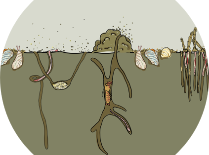

# Btrait: working with biological data and trait information

<center>
<br>
<h4>Karline Soetaert and Olivier Beauchard</h4>
<br>
<h5>Netherlands Institute for Sea Research</h5>
<br><br>

</center>

<br><br>
**Btrait** is an R-package that facilitates working with species density data, combined with species traits in **R**. 
<br>
Apart from several R-functions, it also contains:

- Several species density data sets (northsea macrobenthos)
- Several trait databases (macrobenthos)

<br>

An interactive shiny to visualise these data is in the accompanying package BtraitWeb

<br>
The R- package is created in the framework of the EMODnet biology project.
<br><br>


</center>

<br>

## Installation

Before installing the *Btrait* package, you need to first install the following R-packages and their dependencies:

* *plot3D*, for the simple plotting functions;
* *devtools*, required for a seamless installation of the Btrait package from this github repository. 

During the creation, we made use of the R-package *worms* (now superseded by package *worrms*), for the taxonomic relationships;

<br><br>
Once the above packages have been installed, type the following command in the R-console to install the *Btrait* package:

```
devtools::install_github("EMODnet/Btrait", depend=TRUE, build_vignettes=TRUE)
```

If you do not want to install the vignettes, then you may delete the *build_vignettes = TRUE* part.

Then, type ``require(Btrait)`` in the R-console to load the package in R. 

That's it! After this step, you should be able to use the package. 

You may want to try the interactive tool, which is included in the BtraitWeb package (You need to install this first). 

```
require(BtraitWeb)
webMWTL()
```
<br>

## Getting help

As for any other R-package, you can get extra help by entering ``?Btrait`` in the R console.

There are two vignettes in the package, that can be triggered with
``vignette("Btrait")`` or ``vignette("BtraitData")`` in the R console.

<br>

## Uninstall

To uninstall the *Btrait* package, locate it in the "Packages" tab in *Rstudio*, and click on the encircled "x" button ("Remove package") on the right margin.

To uninstall the package manually, type the following command in the R-console (the version of the library may differ, here we assume 4.1):

* Windows users: 
  ```
  remove.packages("Btrait", lib="~/R/win-library/4.1")
  ```
* Linux users: 
  ```
  remove.packages("Btrait", lib="~/R/x86_64-pc-linux-gnu-library/4.1")
  ```

---

During the transition from version 0.01 to version 1.0.1 the names of functions have changed. For instance, the function getTrait is now called get_trait. This means that any code that uses the old version will need to be adapted.

Starting from version 1.0.1, backward compatibility will be ensured.

Last updates: 2025-01-29
